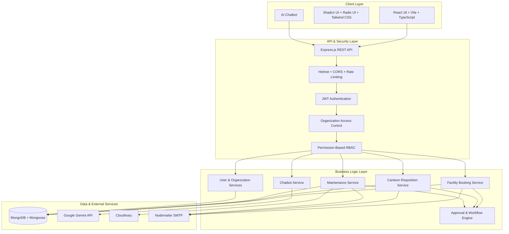
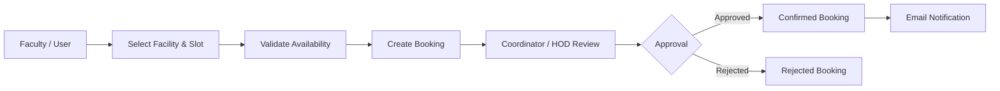
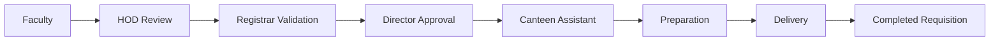
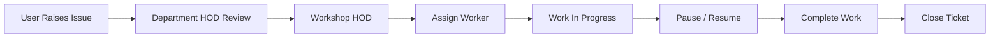
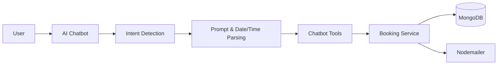
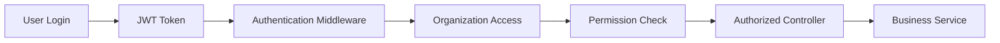

# College Management — MITAOE Unified ERP

**College Management** is an enterprise-style, multi-tenant college management and campus facility platform designed to centralize **facility booking, canteen requisitions, maintenance management, organization administration, role-based access control, and AI-powered assistance** into a single unified ERP system.

The application follows a modern monorepo architecture with a **React + Vite frontend** and an **Express.js + MongoDB backend**, supported by JWT authentication, permission-based RBAC, email notifications, Cloudinary storage, and a Gemini-powered conversational chatbot.

---

## 🏛️ System Architecture



---

## 🔄 Core Workflow Pipelines

### 1. Facility & Hall Booking



### 2. Canteen Requisition



### 3. Maintenance Workflow



The backend organizes these responsibilities into dedicated booking, chatbot, workflow, service, controller, model, middleware, and utility layers.

---

## 🛠️ Tech Stack

### Frontend

* **Framework:** React 18
* **Build Tool:** Vite
* **Language:** TypeScript
* **UI:** Shadcn UI, Radix UI
* **Styling:** Tailwind CSS
* **Routing:** React Router DOM
* **State & Data Fetching:** TanStack React Query
* **HTTP Client:** Axios
* **Forms:** React Hook Form + Zod
* **Charts:** Recharts
* **Icons:** Lucide React
* **Notifications:** Sonner
* **Date Handling:** date-fns

The frontend package currently uses React 18.3, Vite, TypeScript, React Router, TanStack Query, Axios, Recharts, Tailwind CSS, Radix UI and related UI libraries.

### Backend

* **Runtime:** Node.js
* **Framework:** Express.js
* **Language:** JavaScript / ES Modules
* **Database:** MongoDB
* **ODM:** Mongoose
* **Authentication:** JWT
* **Password Security:** bcryptjs
* **Security:** Helmet, CORS, Express Rate Limit
* **Logging:** Morgan + Custom Logger
* **Email:** Nodemailer
* **File & Media Storage:** Cloudinary
* **AI:** Google Gemini API

The backend package uses Express, Mongoose, JWT, bcryptjs, Cloudinary, Nodemailer, Helmet and Express Rate Limit as core dependencies.

---

## ✨ Key Features & Modules

### 1. 🏢 Multi-Tenant Organization Management

* Organization-scoped application architecture.
* Separate users and resources for each organization.
* Organization-level administration.
* Platform-level `super_admin` access.
* Organization access validation through `organizationId`.
* Dedicated organization, user, category and utility management.

This architecture ensures that users and resources are accessed within their authorized organization scope.

---

### 2. 🏛️ Facility & Hall Booking

* Facility and utility booking management.
* Availability validation before booking.
* Organization-specific facilities.
* Approval workflows for bookings.
* Booking history and status management.
* Unified booking model for hall and utility reservations.
* AI-assisted booking through the chatbot.
* Automated 5-minute temporary slot locks with background cleanup to prevent booking conflicts.

---

### 3. 🤖 AI-Powered Conversational Assistant

The platform includes an integrated **Google Gemini-powered chatbot**.

The chatbot layer contains dedicated components for:

* Intent detection.
* Date and time parsing.
* Conversational prompts.
* Tool-based interactions.
* Hall booking assistance.
* Facility availability queries.
* Conversational access to booking functionality.



The repository specifically exposes `/api/chat` through the chatbot service and includes intent, tools, prompt, and date/time parsing modules.

---

### 4. 🍽️ Canteen Management & Requisitions

* Canteen menu management.
* Food requisition creation.
* Organization-specific canteen operations.
* Multi-stage approval workflow.
* HOD approval.
* Registrar validation.
* Director approval.
* Canteen fulfillment.
* Requisition status tracking.
* Email notifications during workflow transitions.

The backend exposes dedicated canteen-menu and requisition functionality under organization-scoped routes.

---

### 5. 🔧 Workshop & Maintenance Management

* Maintenance ticket creation.
* Issue categorization.
* Organization-specific maintenance operations.
* HOD verification.
* Workshop HOD approval.
* Technician/worker assignment.
* Work progress tracking.
* Pause and resume workflow.
* Completion and closure.
* Maintenance lifecycle management.
* Image/media support through Cloudinary.

The backend contains dedicated maintenance services and workflows, with `MaintenanceTicket` represented in the data model.

---

### 6. 🔐 Authentication & Role-Based Access Control

The system implements **JWT-based authentication combined with permission-based RBAC**.

Authentication flow:



Security mechanisms include:

* JWT Bearer authentication.
* Password hashing with bcryptjs.
* Permission matrix.
* Route-level authorization.
* Organization-level access validation.
* HTTP security headers through Helmet.
* CORS configuration.
* API rate limiting.
* Input validation.
* Safe user-input regex handling.
* Centralized error handling.

The backend's permission system uses `requirePermission`, while organization access is enforced through `requireOrgAccess`.

---

## 👥 Role-Based Access Control

The application supports multiple roles across the college ecosystem:

| Role                   | Scope        | Primary Responsibilities                  |
| :--------------------- | :----------- | :---------------------------------------- |
| **Super Admin**        | Platform     | Platform-level administration             |
| **Organization Admin** | Organization | College administration & configuration    |
| **Coordinator**        | Organization | Utilities, bookings & approvals           |
| **HOD**                | Department   | Departmental approvals                    |
| **Registrar**          | Institution  | Administrative & budget validation        |
| **Director**           | Institution  | Executive approvals                       |
| **Faculty**            | Organization | Bookings, requisitions & service requests |
| **Workshop HOD**       | Workshop     | Maintenance approval & worker assignment  |
| **Worker**             | Workshop     | Maintenance task execution                |
| **Canteen Owner**      | Canteen      | Canteen operations & fulfillment          |

These roles are defined in the backend user/permission architecture.

---

## 🗂️ Repository Structure

```text
college_Management/
│
├── backend/
│   ├── src/
│   │   ├── booking/
│   │   ├── chatbot/
│   │   ├── config/
│   │   ├── controllers/
│   │   ├── middleware/
│   │   ├── models/
│   │   ├── routes/
│   │   ├── services/
│   │   ├── utils/
│   │   ├── workflows/
│   │   ├── app.js
│   │   └── server.js
│   │
│   ├── scripts/
│   ├── .env.example
│   ├── BACKEND_SCAN.md
│   └── package.json
│
├── frontend/
│   ├── src/
│   ├── public/
│   ├── .env.example
│   ├── package.json
│   └── vite.config.*
│
├── docs/
│   └── CONVENTIONS.md
│
├── implementation_plan.md
├── package.json
└── README.md
```

The repository currently follows this backend/frontend/docs monorepo organization.

---

## 🚀 Quick Start & Installation

### Prerequisites

* **Node.js** v18 or higher
* **MongoDB** local instance or MongoDB Atlas
* **npm**
* Google Gemini API key — optional for AI chatbot functionality
* SMTP credentials — optional for email notifications
* Cloudinary credentials — required for media functionality where enabled

---

### 1. Clone the Repository

```bash
git clone https://github.com/samadhanmane/college_Management.git
cd college_Management
```

---

### 2. Backend Setup

```bash
cd backend

# Create environment file
cp .env.example .env

# Install dependencies
npm install

# Start development server
npm run dev
```

The backend development script runs the Express server using Node's watch mode.

By default:

```text
http://localhost:4000
```

---

### 3. Frontend Setup

Open another terminal:

```bash
cd frontend

# Install dependencies
npm install

# Start Vite development server
npm run dev
```

The frontend uses Vite's development server.

By default:

```text
http://localhost:5173
```

---

## ⚙️ Environment Variables

### Backend — `backend/.env`

| Variable         | Description               | Example                         |
| :--------------- | :------------------------ | :------------------------------ |
| `MONGODB_URI`    | MongoDB connection string | `mongodb+srv://...`             |
| `JWT_SECRET`     | JWT signing secret        | `your_secret_key`               |
| `PORT`           | Backend server port       | `4000`                          |
| `GEMINI_API_KEY` | Google Gemini API key     | `your_api_key`                  |
| `SMTP_HOST`      | SMTP server               | `smtp.gmail.com`                |
| `SMTP_PORT`      | SMTP port                 | `587`                           |
| `SMTP_USER`      | SMTP username             | `noreply@example.com`           |
| `SMTP_PASS`      | SMTP/app password         | `your_password`                 |
| `LOG_LEVEL`      | Application logging level | `info`                          |
| `CLOUDINARY_*`   | Cloudinary credentials    | `cloud_name / api_key / secret` |

The repository currently documents `MONGODB_URI` and `JWT_SECRET` as production requirements, with SMTP, Gemini and logging configuration available as optional environment configuration.

### Frontend — `frontend/.env`

```env
VITE_API_URL=http://localhost:4000/api
```

---

## 🔌 API Architecture

The backend follows a layered architecture:

```text
Request
   ↓
Route
   ↓
Authentication Middleware
   ↓
Organization Access
   ↓
Permission / RBAC Check
   ↓
Controller
   ↓
Service
   ↓
Mongoose Model
   ↓
MongoDB
```

Feature areas include:

| Feature                        | API Prefix                             |
| :----------------------------- | :------------------------------------- |
| Authentication                 | `/api/auth`                            |
| Organizations                  | `/api/organizations`                   |
| Organization Users & Resources | `/api/orgs/:orgId/...`                 |
| Bookings                       | `/api/orgs/:orgId/bookings`            |
| Canteen Menu                   | `/api/orgs/:orgId/canteen-menu`        |
| Requisitions                   | Organization-scoped requisition routes |
| Maintenance                    | `/api/orgs/:orgId/maintenance`         |
| AI Chat                        | `/api/chat`                            |

These route groups and service boundaries are documented in the repository's backend architecture scan.

---

## 🛡️ Security Architecture

College Management incorporates multiple layers of application security:

* JWT authentication.
* bcrypt password hashing.
* Permission-based RBAC.
* Organization-level isolation.
* Helmet security headers.
* CORS protection.
* Express rate limiting.
* Input validation.
* Safe regular-expression handling.
* Centralized HTTP error handling.
* Mongoose validation and duplicate handling.
* Protected organization-scoped API routes.

Error responses follow a centralized structure, while rate-limited requests return HTTP `429`.

---

## 📚 Documentation

Additional technical documentation is available inside the repository:

* [`docs/CONVENTIONS.md`](docs/CONVENTIONS.md) — API, validation, error handling and naming conventions.
* [`backend/BACKEND_SCAN.md`](backend/BACKEND_SCAN.md) — backend architecture and module overview.
* [`implementation_plan.md`](implementation_plan.md) — implementation planning and project structure.

---

## 🧪 Development Commands

### Backend

```bash
cd backend

# Development
npm run dev

# Production-style start
npm start

# Smoke tests
npm run smoke
```

### Frontend

```bash
cd frontend

# Development
npm run dev

# Production build
npm run build

# Development build
npm run build:dev

# Lint
npm run lint

# Preview production build
npm run preview
```

---

## 🌟 Project Highlights

| Capability         | Implementation                   |
| :----------------- | :------------------------------- |
| **Frontend**       | React + TypeScript + Vite        |
| **Backend**        | Node.js + Express.js             |
| **Database**       | MongoDB + Mongoose               |
| **Authentication** | JWT + bcryptjs                   |
| **Authorization**  | Permission-based RBAC            |
| **Multi-Tenancy**  | Organization-scoped architecture |
| **Slot Locking**   | MongoDB 5-Min TTL & Lock Sweeper |
| **AI Assistant**   | Google Gemini                    |
| **Email**          | Nodemailer                       |
| **Media Storage**  | Cloudinary                       |
| **Security**       | Helmet + CORS + Rate Limiting    |
| **Data Fetching**  | TanStack React Query             |
| **UI**             | Shadcn UI + Radix UI + Tailwind  |
| **Charts**         | Recharts                         |

---

## 👨‍💻 Author & Maintainer

**Samadhan Mane**

* **Repository:** https://github.com/samadhanmane/college_Management
* **Project:** MITAOE Unified ERP
* **Architecture:** Full-Stack MERN-style Monorepo
* **Focus:** College Management, Facility Booking, Workflow Automation & AI Assistance

---

## 📄 License

This project is intended for educational, institutional, and development purposes. Refer to the repository for the applicable licensing and usage terms.
